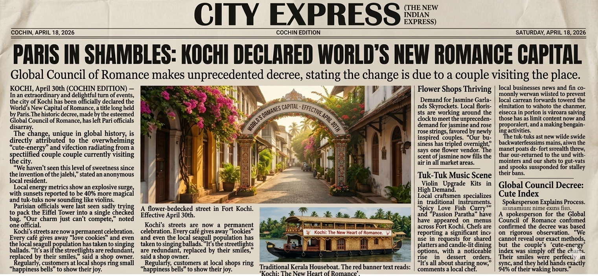

# kochi-romance-news
index.html
<!DOCTYPE html>
<html>
<head>
  <title>City Express - Kochi Romance Capital</title>
  <meta name="viewport" content="width=device-width, initial-scale=1.0">

  
</head>

<body>

  

    

      COCHIN, APRIL 18, 2026
      COCHIN EDITION
      SATURDAY
    

    <h1>CITY EXPRESS</h1>
  

  

    PARIS IN SHAMBLES: KOCHI DECLARED WORLD’S NEW ROMANCE CAPITAL
  

  

    Global Council of Romance makes unprecedented decree, stating the change is due to a couple visiting the place.
  

  

    <!-- LEFT COLUMN -->
    

      
<b>Kochi, April 30:</b> In a landmark declaration, Kochi has officially been named the World’s New Capital of Romance, replacing Paris in a historic shift.

      
The Global Council of Romance cited an unprecedented surge in “cute-energy” radiating from a visiting couple currently in the city.

      
“We haven’t seen this level of sweetness since the invention of the jalebi,” said an anonymous resident.

      
Local metrics show sunsets appearing 40% more magical, while tuk-tuks now emit violin-like melodies.

      
Paris officials were reportedly seen attempting to pack the Eiffel Tower into a single checked bag.

      
“Our charm just can’t compete,” noted one official.

      
Kochi’s streets are now filled with celebration. Cafés give away “love cookies,” and even seagulls are said to sing ballads.

      
Shop owners confirm that customers now ring “happiness bells” regularly to express joy.

    

    <!-- CENTER COLUMN -->
    

      
      

        A flower-decked street in Fort Kochi. Effective April 30.
      

      
Kochi’s streets have transformed into a permanent celebration. Every café offers tokens of affection, and the city feels alive with romance.

      
Regularly, customers gather, share smiles, and create moments that redefine the idea of love in public spaces.

    

    <!-- RIGHT COLUMN -->
    

      
Flower Shops Thriving

      
Demand for jasmine garlands and roses has surged dramatically. Florists are working round the clock.

      
Tuk-Tuk Music Scene

      
Violin upgrade kits for tuk-tuks are now trending, adding a musical charm to daily commutes.

      
Culinary Romance

      
Restaurants report increased demand for candle-light dinners and shared dessert platters.

      
Global Council Decree

      
Officials confirmed the decision was based on advanced “cute-index” analysis.

      
The visiting couple reportedly scored record-high emotional resonance levels.

      
“Their smiles aligned perfectly, and their presence elevated the city’s emotional frequency,” said a spokesperson.

    

  

</body>
</html>
